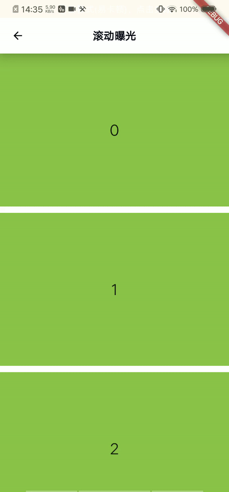
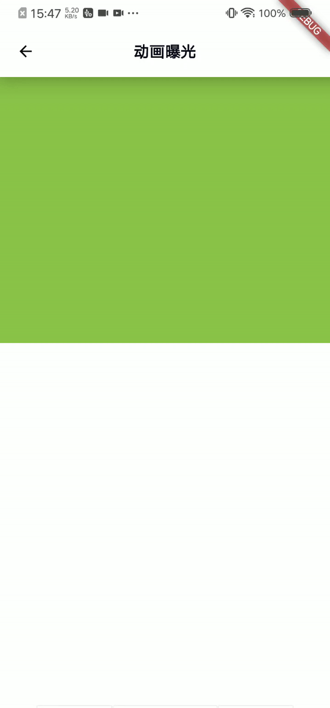

Exposure Widget
====
[中文](./README_CN.md)

This is a widget that can automatically monitor whether the child widget is exposed

When the child widget is found in the window viewport, it begin detecting.

When stay time exceeds the exposure time condition (default is 0.5s) and the exposure area is greater than the visibility fraction condition (default 50%),It will trigger the exposure callback and record the Key value in a queue (the default is to store up to 100 keys).

When encounter the same key in the queue, it won't detect

install
----
Add this to your package's pubspec.yaml file
```yaml
dependencies:
  exposure: ^1.0.3
```

usage
----
```dart
ExposureDetector({
    key: Key('exposure'),  // Custom Key
    child: childWidget, //Child Widget
    exposure: callBack // Exposure Callback
});
```

#### Examples

[Scroll List Exposure](./example/exposureScrollExample.dart)



[Animate Exposure](./example/exposureAnimateExample.dart)



[Dialog Exposure](./example/exposureDialogExample.dart)


Configuration
---

* ExposureDetectorController.instance.setFilterList：Function (default 100) Set key queue<br/>
* ExposureDetectorController.instance.exposureTime：Int (default 500) Set exposure time condition (ms)<br/>
* ExposureDetectorController.instance.exposureFraction：Double (default 0.5) Set visibility fraction condition<br/>
* ExposureDetectorController.instance.updateInterval：Duration (default Duration(milliseconds: 200))Set delay detection time
